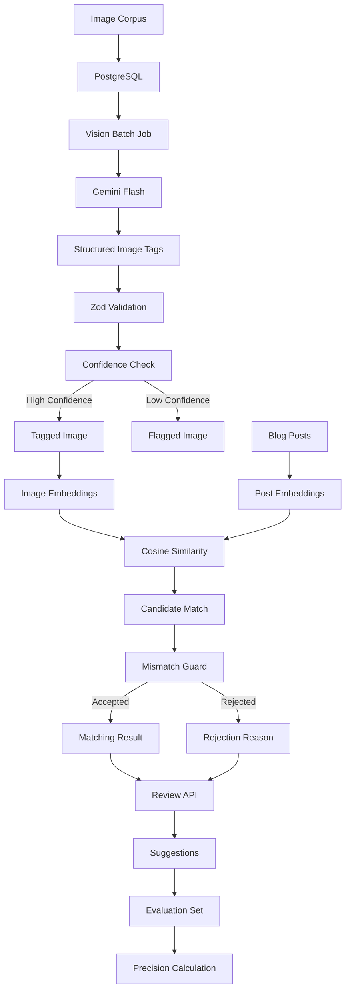

# FlyRank Capstone — AI Image Understanding & Content Matching Engine

[](https://github.com/yourusername/flyrank-capstone-image-relevance)
[](https://github.com/yourusername/flyrank-capstone-image-relevance)
[](https://opensource.org/licenses/MIT)

An AI-powered backend system that automatically analyzes images, generates structured visual metadata, creates embeddings, and matches images to blog posts.

The system also includes a **mismatch guard** that rejects obviously incorrect matches and provides an explanation for the rejection.

---

## Table of Contents

- [Overview](#overview)
- [Features](#features)
- [Architecture](#architecture)
- [Technology Stack](#technology-stack)
- [Project Structure](#project-structure)
- [Getting Started](#getting-started)
- [API Documentation](#api-documentation)
- [Testing](#testing)
- [Evaluation Results](#evaluation-results)
- [Known Limitations](#known-limitations)
- [Project Status](#project-status)
- [Acknowledgments](#acknowledgments)

---

## Overview

The goal of this project is to build a backend pipeline that can determine which images are most relevant to a given blog post.

The system processes images through several stages:

1. Images are stored and registered in PostgreSQL.
2. Gemini Flash analyzes each image and produces structured metadata.
3. The metadata is validated using Zod.
4. Image and post embeddings are generated.
5. Cosine similarity is used to rank potential matches.
6. A mismatch guard checks whether the selected image is actually appropriate.
7. A review API allows matches to be approved or rejected.
8. An evaluation set measures matching performance.

The project was developed as part of the **FlyRank Backend Internship capstone**.

---

# Features

## Phase 1 — Design & Setup

- Architecture and data model designed before implementation
- PostgreSQL database with 6 tables
- Database indexes and constraints
- 50-image test corpus
- Sample blog posts for evaluation

## Phase 2 — Vision Pipeline

- Gemini Flash used for image understanding
- Structured image metadata generated from visual input
- Zod schema validation
- Batch image processing
- Retry and rate-limit handling
- Confidence scoring
- Low-confidence image flagging
- Per-call cost tracking
- 45 of 50 images successfully processed

## Phase 3 — Matching Engine & Mismatch Guard

- 44 image embeddings generated
- 7 post embeddings generated
- Cosine similarity used for ranking
- Mismatch guard for incorrect image matches
- Category validation
- Subject validation
- Similarity threshold validation
- Human review API
- Suggestions table for tracking matching decisions

## Phase 4 — Evaluation & Production Layer

- Evaluation dataset with 5 labeled post/image pairs
- Automated precision calculation
- Top-1 precision of **80%**
- Architecture and implementation documentation
- Known limitations documented

---

# Architecture

The system follows a staged pipeline from image ingestion through AI analysis, embedding generation, matching, validation, and evaluation.



### Pipeline Summary

| Stage | Purpose |
|---|---|
| Image ingestion | Register images in PostgreSQL |
| Vision analysis | Extract visual information using Gemini Flash |
| Validation | Validate AI output using Zod |
| Confidence check | Identify uncertain predictions |
| Embeddings | Convert images/posts into vectors |
| Similarity | Rank image candidates |
| Mismatch guard | Reject clearly incorrect matches |
| Review | Allow human approval/rejection |
| Evaluation | Measure matching performance |

---

# Technology Stack

## Backend

| Component | Technology |
|---|---|
| Runtime | Node.js |
| Framework | Express |
| Language | TypeScript |
| Database | PostgreSQL 16 |
| Database Driver | `pg` |
| Validation | Zod |
| AI Vision Model | Gemini 3.6 Flash |
| Embedding Model | Gemini Embedding 001 |
| Environment Configuration | dotenv |

## Development & Infrastructure

| Component | Technology |
|---|---|
| TypeScript execution | tsx |
| Database | PostgreSQL |
| Database environment | Docker |
| Package manager | npm |
| API | REST |

---

# Project Structure

```text
flyrank-capstone-image-relevance/
│
├── DESIGN.md
├── README.md
├── EVIDENCE.md
├── BUILDLOG.md
├── capstone.yaml
├── .env.example
├── .gitignore
├── docker-compose.yml
├── package.json
└── tsconfig.json
│
├── data/
│   ├── images/
│   │   ├── fox-001.jpg
│   │   ├── wolf-001.jpg
│   │   ├── dog-001.jpg
│   │   ├── bear-001.jpg
│   │   └── deer-001.jpg
│   ├── eval-set.json
│   └── posts/
│
├── src/
│   ├── server.ts
│   ├── config.ts
│   │
│   ├── db/
│   │   ├── client.ts
│   │   └── migrations/
│   │
│   ├── repositories/
│   │   ├── images.repository.ts
│   │   ├── imageEmbedding.repository.ts
│   │   ├── posts.repository.ts
│   │   ├── suggestions.repository.ts
│   │   └── costLog.repository.ts
│   │
│   ├── services/
│   │   ├── vision.service.ts
│   │   ├── embedding.service.ts
│   │   ├── matching.service.ts
│   │   ├── mismatchGuard.service.ts
│   │   └── cost.service.ts
│   │
│   ├── routes/
│   │   ├── images.routes.ts
│   │   ├── posts.routes.ts
│   │   └── suggestions.routes.ts
│   │
│   ├── jobs/
│   │   ├── visionBatch.job.ts
│   │   └── embeddingBatch.job.ts
│   │
│   └── validation/
│       └── imageTags.schema.ts
│
├── scripts/
│   ├── seed.ts
│   ├── runBatch.ts
│   ├── testBatch.ts
│   ├── testGuard.ts
│   ├── runEmbeddingBatch.ts
│   ├── computePrecision.ts
│   └── createPosts.ts
│
└── tests/
```

---

# Getting Started

## Prerequisites

Make sure the following are installed:

- Node.js 20+
- Docker
- Docker Compose
- Gemini API key

---

## 1. Clone the Repository

```bash
git clone https://github.com/yourusername/flyrank-capstone-image-relevance.git

cd flyrank-capstone-image-relevance
```

## 2. Install Dependencies

```bash
npm install
```

## 3. Start PostgreSQL

```bash
docker compose up -d
```

Verify that the database container is running:

```bash
docker ps
```

## 4. Run Database Migrations

Connect to PostgreSQL:

```bash
docker exec -it flyrank-capstone-image-relevance-postgres-1 \
psql -U image_user -d image_relevance
```

Run the migration files in order:

```text
src/db/migrations/001_create_images.sql
src/db/migrations/002_create_image_embeddings.sql
src/db/migrations/003_create_posts.sql
src/db/migrations/004_create_post_embeddings.sql
src/db/migrations/005_create_suggestions.sql
src/db/migrations/006_create_cost_log.sql
```

Exit PostgreSQL:

```sql
\q
```

## 5. Configure Environment Variables

Create the environment file:

```bash
cp .env.example .env
```

Add your Gemini API credentials and database configuration to `.env`.

> Do not commit `.env` to GitHub.

## 6. Seed the Database

Load the test images:

```bash
npx tsx scripts/seed.ts
```

## 7. Run the Vision Pipeline

Process pending images:

```bash
npx tsx scripts/runBatch.ts
```

## 8. Generate Embeddings

```bash
npx tsx scripts/runEmbeddingBatch.ts
```

## 9. Start the API Server

```bash
npx tsx src/server.ts
```

The API will be available locally at:

```text
http://localhost:3000
```

## 10. Test the Mismatch Guard

The mismatch guard does not require an API call:

```bash
npx tsx scripts/testGuard.ts
```

---

# API Documentation

## Vision Pipeline

### Process Images

```http
POST /api/images/batch-process
```

Triggers processing for pending images.

Example response:

```json
{
  "success": true,
  "processed": 10,
  "tagged": 10,
  "flagged": 0,
  "failed": 0,
  "quota_exhausted": false
}
```

### Get Image Status

```http
GET /api/images/:id
```

Returns image metadata and processing status.

### Get Processing Statistics

```http
GET /api/images/stats
```

Returns processing statistics and accumulated processing cost.

Example:

```json
{
  "pending": 5,
  "processing": 0,
  "tagged": 45,
  "flagged": 0,
  "failed": 0,
  "total_cost": 0.006075
}
```

---

# Posts & Matching

## Create a Post

```http
POST /api/posts
Content-Type: application/json
```

Request:

```json
{
  "title": "The Behavior of Red Foxes",
  "body": "Red foxes are highly adaptable mammals...",
  "category": "animal"
}
```

## Get Matching Image

```http
GET /api/posts/:id/images
```

Returns the best matching image or explains why the candidate was rejected.

Example accepted response:

```json
{
  "post_id": "b1eb923d-94e4-483d-b415-829912bd4558",
  "post_title": "The Behavior of Red Foxes",
  "accepted": true,
  "image_id": "3102d561-2a64-4080-a0dd-e78e79ebe79b",
  "similarity_score": 0.692,
  "candidate": {
    "image_id": "3102d561-2a64-4080-a0dd-e78e79ebe79b",
    "subject": "red fox",
    "category": "animal",
    "caption": "A red fox sitting on a large weathered log...",
    "confidence": 0.98,
    "similarity_score": 0.692
  }
}
```

Example rejected response:

```json
{
  "post_id": "2ed89345-23a4-4452-928f-ad7bb927d738",
  "post_title": "The Life of Oak Trees",
  "accepted": false,
  "reason": "Category mismatch: expected \"plant\", got \"animal\"",
  "similarity_score": 0.604
}
```

---

# Testing

## Mismatch Guard

Run:

```bash
npx tsx scripts/testGuard.ts
```

The test suite covers:

| Scenario | Expected |
|---|---|
| Fox post → Fox image | Accepted |
| Fox post → Wolf image | Rejected |
| Fox post → Dog image | Rejected |
| Plant post → Animal image | Rejected |
| Low similarity candidate | Rejected |

The guard checks:

- Category compatibility
- Subject compatibility
- Similarity threshold
- Candidate confidence

---

## Vision Pipeline Test

Run:

```bash
npx tsx scripts/testBatch.ts
```

## Full Vision Batch

Run:

```bash
npx tsx scripts/runBatch.ts
```

## Embedding Generation

Run:

```bash
npx tsx scripts/runEmbeddingBatch.ts
```

## Precision Evaluation

Run:

```bash
npx tsx scripts/computePrecision.ts
```

---

# Evaluation Results

The evaluation set contains **5 labeled post/image pairs**.

### Top-1 Precision

**80.0% — 4 out of 5 correct matches**

### Key Metrics

| Metric | Result |
|---|---:|
| Total images | 50 |
| Images successfully tagged | 45 |
| Image embeddings | 44 |
| Posts created | 7 |
| Post embeddings | 7 |
| Evaluation pairs | 5 |
| Similarity threshold | 0.65 |
| Confidence threshold | 0.70 |
| Top-1 precision | 80.0% |

### Guard Results

| Scenario | Expected | Result |
|---|---|---|
| Fox → Fox | Accepted | ✅ Accepted |
| Wolf → Wolf | Accepted | ✅ Accepted |
| Dog → Dog | Accepted | ❌ Rejected |
| Bear → Bear | Accepted | ✅ Accepted |
| Deer → Deer | Accepted | ✅ Accepted |
| Plant → Animal | Rejected | ✅ Rejected |

The dog case demonstrates an important limitation of the current guard: a semantically related image can still be rejected when the subject information extracted from the post does not sufficiently match the candidate image.

---

# Known Limitations

The current implementation intentionally operates on a relatively small evaluation corpus.

### 1. Small Dataset

The test corpus contains approximately 50 images.

This is sufficient to demonstrate the pipeline and guard behavior, but it is not large enough to establish production-level generalization.

### 2. Limited Domain

The current dataset focuses primarily on animal/wildlife imagery.

Additional domains such as technology, food, travel, and people would require broader evaluation.

### 3. Small Evaluation Set

The current evaluation uses five labeled post/image pairs.

The 80% precision result should therefore be treated as an initial evaluation rather than a statistically significant production benchmark.

### 4. API Quota Constraints

Five images remained pending during one processing run because of the available Gemini API quota.

The pipeline records failed and pending work rather than silently treating those images as successfully processed.

### 5. Preloaded Images

Images currently need to be loaded into the system before processing.

Real-time ingestion is a potential future improvement.

### 6. Embedding Storage

Embeddings are currently stored as arrays.

For a larger production dataset, a vector database or PostgreSQL `pgvector` extension would be a more appropriate approach.

### 7. Single Vision Model

The current implementation uses Gemini Flash for image analysis.

A future iteration could compare multiple vision models and evaluate differences in accuracy, latency, and cost.

---

# Project Status

| Phase | Status | Result |
|---|---|---|
| Phase 1 — Design & Setup | ✅ Complete | Database, architecture, test corpus |
| Phase 2 — Vision Pipeline | ✅ Complete | 45/50 images tagged |
| Phase 3 — Matching Engine | ✅ Complete | Embeddings, matching, mismatch guard |
| Phase 4 — Evaluation | ✅ Complete | 80% Top-1 precision |

**Total tests passed: 16+**

---

# What This Project Demonstrates

This project demonstrates practical backend engineering and AI integration skills, including:

- REST API development
- TypeScript and Node.js
- Express
- PostgreSQL
- Database design and migrations
- Repository/service architecture
- AI vision integration
- Embeddings
- Semantic similarity
- Structured AI output validation
- Batch processing
- Retry and rate-limit handling
- Confidence scoring
- Defensive matching logic
- Human-in-the-loop review
- Automated evaluation
- Cost tracking
- Docker-based development

---

# Acknowledgments

Built as part of the **FlyRank Backend Internship Capstone**.

Special thanks to the FlyRank team for the capstone brief, technical guidance, and feedback.
